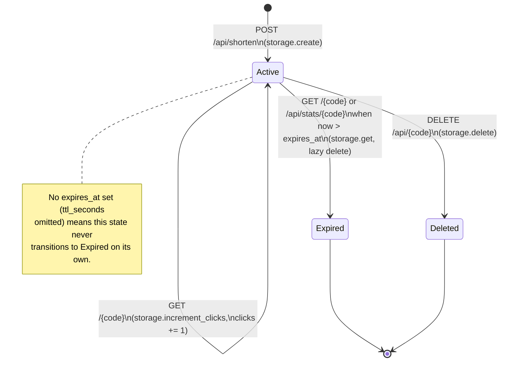

# URL Shortener — Architecture Reference (written for a new engineer)

If you're picking this codebase up for the first time, read this file top to
bottom — each section assumes only the previous one. Code-level details live
next to the code (short comments in `scripts/*.py`); this file is where the
*why* lives.

## Contents
- What this service does, in plain terms
- Component overview (which file talks to which)
- Link lifecycle (state diagram)
- Data model
- In-memory store design
- Code generation
- API surface
- Security design (validation & malicious-input controls)
- Trade-offs & limitations

## What this service does, in plain terms

A URL shortener takes a long link (`https://example.com/some/very/long/path`)
and gives you back a short one (`http://localhost:8000/aZ3kQ9x`). Visiting
the short one redirects you to the long one. That's the whole product. The
interesting engineering is in three places:

1. **Core APIs** — create a short link, follow it, look up its stats, delete it.
2. **Analytics** — every time a short link is followed, we count it and
   record when it last happened.
3. **Reliability / safety** — a URL shortener is a classic abuse target
   (attackers use it to disguise malicious links, or to make a server fetch
   something it shouldn't — more on this in "Security design" below). This
   service validates every input before it's allowed to become a
   redirectable short link.

Everything is **in-memory** (a Python dictionary, not a database) — this is
a deliberate simplification for a prototype, explained in "Trade-offs" below.

## Component overview

```
                    ┌─────────────────────────────────────────┐
                    │              FastAPI app.py               │
                    │  (routes: /api/shorten, /{code},           │
                    │   /api/stats/{code}, /api/{code}, /health) │
                    └───────────────┬─────────────────────────┘
                                     │
              ┌──────────────────────┼──────────────────────┐
              ▼                      ▼                      ▼
     ┌────────────────┐   ┌──────────────────┐   ┌─────────────────┐
     │  models.py       │   │  validators.py     │   │  shortener.py     │
     │  Pydantic I/O     │   │  scheme allowlist   │   │  base62 code gen   │
     │  request/response │   │  SSRF blocklist     │   │  collision retry    │
     │  schemas          │   │  alias rules        │   │  loop                │
     └────────────────┘   └──────────────────┘   └────────┬────────┘
                                     │                      │
                                     ▼                      ▼
                            ┌─────────────────────────────────┐
                            │            storage.py               │
                            │  InMemoryStore (dict + Lock)         │
                            │  LinkRecord: code, long_url,         │
                            │  created_at, expires_at, clicks,     │
                            │  last_accessed_at                     │
                            └─────────────────────────────────┘
```

**Why split into six small files instead of one big `app.py`?** Each file
has exactly one job, so you can change one without needing to hold the whole
system in your head:

| File | Job | You'd touch this if... |
|---|---|---|
| `models.py` | Defines the *shape* of requests/responses (what JSON fields exist, what's required) | ...you're adding a new field to the API, like `title` for a link |
| `validators.py` | Decides whether a URL/alias is *safe and well-formed* | ...you're adding a new security rule (see `examples.md` for the exact pattern) |
| `shortener.py` | Generates the random short code | ...you wanted longer/shorter codes, or a different alphabet |
| `storage.py` | Remembers link data in memory, thread-safely | ...you were swapping in a real database |
| `app.py` | Wires the above together into HTTP routes | ...you're adding a new endpoint |
| `test_app.py` | Proves all of the above actually works | ...always — see "Validation & risk control" below |

`app.py` is the only file that imports the other four; `models.py`,
`validators.py`, and `shortener.py` never import each other. This one-way
dependency structure is called a "hub and spoke" — it means you can read and
reason about `validators.py` completely on its own, without needing to know
anything about `app.py`.

**Request flow for creating a short link** (`POST /api/shorten`):
1. `app.py` receives the request, FastAPI + `models.py` check the JSON shape.
2. `app.py` calls `validators.validate_url()` — is this URL safe to shorten?
   If not, stop here and return an error (HTTP `422`).
3. If the caller asked for a specific short code (`custom_alias`),
   `app.py` calls `validators.validate_alias()`. Otherwise it calls
   `shortener.generate_code()` to pick a random one.
4. `app.py` calls `storage.create()` to remember the mapping.
5. The response goes back with the new short code.

**Request flow for following a short link** (`GET /{code}`):
1. `app.py` calls `storage.get()`. This also silently expires the link if
   its time-to-live has passed (see the state diagram below).
2. If it's still valid, `app.py` calls `storage.increment_clicks()` (the
   analytics part) and returns an HTTP redirect to the browser.

## Link lifecycle (state diagram)

Every link (`LinkRecord`) is always in exactly one of these states.
**Expiry is checked lazily** — meaning: there's no background job counting
down timers. Instead, the *next time anyone reads* an expired link, that
read is the moment it gets deleted. This is a common simplification in
small services: it avoids running an extra background process, at the cost
of an expired-but-never-read link sitting in memory a bit longer than
strictly necessary (see "Trade-offs" below).



Two things worth noticing:
- **`Active --> Active` self-loop**: clicking a short link doesn't change
  its *state* — it's still Active — it just bumps the `clicks` counter.
  A link can be clicked any number of times.
- **No background "reaper" process**: both ways out of Active are triggered
  by a specific request (`DELETE`, or any read that notices the link has
  expired), never by a timer running in the background.

## Data model

Each link is one `LinkRecord` (defined in `scripts/storage.py`):

```python
LinkRecord(code, long_url, created_at, expires_at, clicks, last_accessed_at)
```

Think of this as one row in a (very simple, in-memory) table, where `code`
is the primary key:

| Field | Meaning |
|---|---|
| `code` | The short code, e.g. `aZ3kQ9x` — this is the dictionary key in `InMemoryStore` |
| `long_url` | The original URL this code redirects to |
| `created_at` | When the link was created |
| `expires_at` | Optional — if set (via `ttl_seconds` when creating), the link stops working after this time |
| `clicks` | How many times this link has been followed — the analytics counter |
| `last_accessed_at` | When it was last followed — also analytics |

## In-memory store design

"In-memory" means the data lives in a plain Python `dict` inside
`InMemoryStore` (`scripts/storage.py`), not in a real database. It disappears
the moment the process stops. That's a real limitation (see "Trade-offs"),
but it makes the prototype trivial to run — no database to install.

**Why is there a `threading.Lock` around a plain dict, if it's "just"
in-memory?** Web servers usually handle more than one request *at the same
time* (that's the whole point of a server). If two requests try to modify
the dictionary at the exact same moment — e.g., two people picking the same
random code, or one person deleting a link while another is reading its
stats — you can get corrupted or inconsistent data. The `Lock` makes sure
only one request can be in the middle of changing the store at a time; every
other request that wants to touch the store waits its turn. This is a
one-line, well-known fix for a subtle, hard-to-reproduce class of bug (a
"race condition").

**Why go through a class (`InMemoryStore`) instead of a bare global dict?**
The class exposes only five methods — `exists`, `create`, `get`,
`increment_clicks`, `delete` — and nothing in `app.py` ever touches the
dictionary directly. That narrow interface is the seam where you'd plug in a
real database (Redis, Postgres, DynamoDB) later: you'd write a new class with
the same five methods, and `app.py` would not need to change at all.

## Code generation

`scripts/shortener.py` picks a random 7-character code from an alphabet of
62 characters (`a-z`, `A-Z`, `0-9` — this is called "base62", the same
technique bit.ly and similar services use).

**Two deliberate choices here, worth understanding:**
- **Random, not sequential.** An obvious alternative is a counter: link 1,
  link 2, link 3... The problem: anyone can then guess every link that's
  ever been created just by trying `/1`, `/2`, `/3`. A random code from a
  62^7 (about 3.5 trillion) possibility space can't be enumerated that way.
- **`secrets.choice`, not `random.choice`.** Python's `random` module is
  *not* safe for anything security-sensitive — it's predictable if you know
  enough about its internal state. `secrets` is specifically designed for
  this (tokens, passwords, codes) and is cryptographically unpredictable.

**What about collisions?** With 3.5 trillion possible codes, two requests
generating the exact same one is astronomically unlikely — but "unlikely"
isn't "impossible," so the code retries up to `MAX_GENERATION_ATTEMPTS = 10`
times if it happens to pick a code that's already taken, and raises a clear
error if it still can't find a free one after 10 tries (which, realistically,
would only happen if something else is badly wrong).

## API surface

| Method | Path | Purpose |
|---|---|---|
| `POST` | `/api/shorten` | Create a short link. Body: `{url, custom_alias?, ttl_seconds?}` → `{code, short_url, long_url, created_at, expires_at}` |
| `GET` | `/{code}` | Redirects (HTTP 307) to the long URL; increments the click counter |
| `GET` | `/api/stats/{code}` | Returns `{code, long_url, created_at, expires_at, clicks, last_accessed_at}` — the analytics endpoint |
| `DELETE` | `/api/{code}` | Removes a mapping; `204` on success, `404` if the code doesn't exist |
| `GET` | `/health` | "Are you alive?" check — used by monitoring/orchestration tools, not humans |

If you supply `custom_alias` when creating a link, it's used as-is instead of
a random code (validated the same way — see below). If someone else already
has that alias, you get `409 Conflict`, not `422` — `422` means "your input
is malformed," `409` means "your input is fine, but it's already taken by
someone else." This distinction matters for API consumers: a `422` means "fix
your request," a `409` means "try a different alias."

## Security design — validation & malicious-input controls

**Why does a URL shortener need serious input validation at all?** Because a
short link is, functionally, "click here and go somewhere else, on my
authority" — and that's exactly what attackers want to abuse. All the checks
below live in `scripts/validators.py` and run *before* anything is saved,
inside `app.py`'s route handler. Note we don't just rely on Pydantic's
built-in `HttpUrl` type — that only checks that a string *looks like* a URL
(has a scheme, a host, etc.); it says nothing about whether that URL is
*safe to redirect people to*, which is the actual question we need answered.

- **Scheme allowlist** — only `http://` and `https://` links are accepted.
  Everything else is rejected, most importantly `javascript:` (this scheme
  runs code in the visitor's browser — classic XSS) and `file://` (this
  would try to open a file on the *visitor's own computer*, not a website).
- **SSRF blocklist** — this is the least obvious one, so it's worth
  explaining slowly:
  - **SSRF = Server-Side Request Forgery.** The idea: if this service (or
    anything acting on its behalf) ever *fetches* a URL rather than just
    redirecting a browser to it, an attacker could submit a URL pointing at
    an address that's only reachable from inside your network or cloud
    environment — like `http://169.254.169.254/`, which on most cloud
    providers returns secrets about the server itself (AWS/GCP/Azure
    "instance metadata"). Even though *this* service only redirects (it
    doesn't fetch), blocking these targets is the standard, defensive thing
    to do for any service that accepts arbitrary URLs from users — because
    it's very easy for that assumption ("we only ever redirect, never
    fetch") to quietly stop being true as the service grows.
  - **How it's blocked**: the hostname in the URL is resolved to an actual
    IP address (if it's already an IP like `127.0.0.1`, that's used
    directly; otherwise a real DNS lookup happens, so a sneaky hostname like
    `internal.mycompany.com` that secretly points at `10.0.0.5` is caught
    too — checking the hostname *string* alone wouldn't catch that).
  - **What's blocked**: loopback addresses (`127.0.0.1`, `localhost`),
    private network ranges (`10.x.x.x`, `172.16-31.x.x`, `192.168.x.x` — the
    ranges reserved for "inside a private network, never on the public
    internet"), link-local addresses (`169.254.x.x`, which is also the cloud
    metadata range mentioned above), and `0.0.0.0`.
- **Length limits** — URLs longer than 2048 characters and aliases longer
  than 32 characters are rejected outright. This isn't really a security
  feature so much as a sanity check — no legitimate link needs to be that
  long, and it caps how much memory one bad request can consume.
- **Alias rules** — a custom alias may only contain letters, numbers,
  hyphens, and underscores, and can't be one of the words the API already
  uses for real routes (`api`, `health`, `docs`, etc.) — otherwise someone
  could create a short link at `/health` and break the health check.
- **Redirect-header safety** — when we send the redirect, the destination
  comes from the *already-validated, already-stored* `long_url`, never
  straight from whatever's in the current request. This avoids a class of
  bug where unsanitized user input ends up directly in an HTTP header.

**What's deliberately *not* handled** (see "Trade-offs" for the reasoning):
rate limiting (nothing stops one caller from creating thousands of links per
second), a real threat-intelligence-backed blocklist of known phishing
domains (we block *categories* of unsafe targets, not a maintained list of
*specific* bad domains), and full DNS-rebinding protection (there's a small
window in time between when we check a URL and when a browser eventually
follows it, during which the target's DNS could theoretically change — this
gap exists in effectively every service that validates a URL up front and
redirects later, and closing it fully would require checking again at
click-time, not just at creation-time).

## Trade-offs & limitations

Being upfront about what this prototype doesn't do is as important as
documenting what it does — a design doc that only lists strengths isn't
trustworthy.

- **In-memory only** — restart the process, lose every link. Fine for a demo
  or for local development; not fine for production. `InMemoryStore`'s
  narrow interface (see above) is specifically there to make swapping in a
  real database a small, contained change later.
- **Single process** — there's no protection against two *separate*
  processes both picking the same random code (the collision check only
  looks at the current process's own dictionary). Running more than one
  instance of this service needs a shared store (e.g. Redis) first.
- **Heuristic security, not a threat feed** — the checks above block whole
  *categories* of unsafe targets (private networks, dangerous schemes).
  They will not catch a `https://totally-legit-phishing-site.com` link,
  because that's a reputation problem, not a shape/network problem — solving
  it for real needs an external threat-intelligence service.
- **No authentication, no rate limiting** — anyone who can reach this
  service can create or delete any link. There's no concept of "my links"
  vs. "your links," and no limit on how many requests one caller can make.
  Both are realistic next steps for a production version, intentionally
  left out of this prototype's scope.
